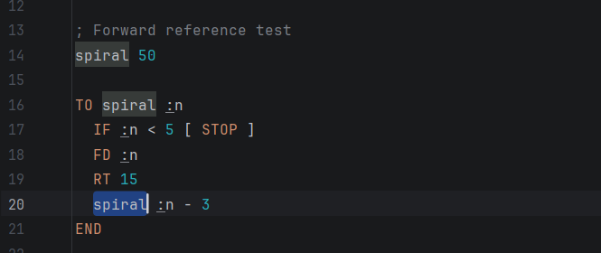
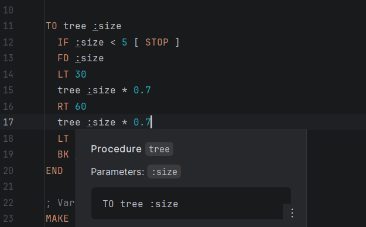
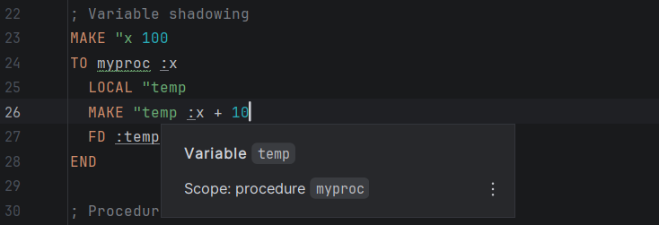
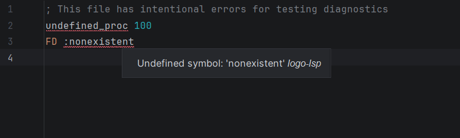

# LOGO Language Server

An LSP server for the LOGO programming language, built in Java with ANTLR4 for parsing and LSP4J for protocol communication.

## Features

- **Syntax highlighting** — semantic tokens for keywords, procedures, variables, numbers, strings, operators, and comments
- **Go-to-definition** — Ctrl+click on procedure calls and variable references to jump to declarations
- **Hover** — tooltips showing symbol type, scope, and procedure signatures
- **Diagnostics** — real-time error detection for undefined symbols and redefinition warnings

### Screenshots


*Semantic highlighting with context-aware token classification*


*Hover tooltip showing procedure signature and parameters*


*Hover tooltip showing variable scope*


*Real-time error detection for undefined procedures*

## LOGO Dialect

This server implements a subset of LOGO inspired by UCBLogo. Since LOGO lacks a strictly defined standard, some choices reflect my own interpretation:

- Case-insensitive keywords and identifiers
- `:name` for variable references, `"name` for quoted words
- `TO...END` for procedure definitions, `[...]` for blocks, `;` for comments

**Supported commands:** `FORWARD/FD`, `BACK/BK`, `LEFT/LT`, `RIGHT/RT`, `PENUP/PU`, `PENDOWN/PD`, `HIDETURTLE/HT`, `SHOWTURTLE/ST`, `HOME`, `CLEARSCREEN/CS`, `SETXY`, `REPEAT`, `IF`, `IFELSE`, `STOP`, `OUTPUT/OP`, `MAKE`, `LOCAL`, `PRINT`

## Build and Run

Prerequisites: Java 21+, Gradle 8.7+ (wrapper included).

```bash
./gradlew build        # compile and run tests
./gradlew fatJar       # build single executable JAR
```

Run the server:

```bash
java -jar build/libs/logo-server-lsp-1.0-SNAPSHOT-all.jar
```

The server uses stdio transport — it reads JSON-RPC on stdin and writes responses to stdout.

## Connecting to IntelliJ (LSP4IJ)

1. Install the [LSP4IJ](https://plugins.jetbrains.com/plugin/23257-lsp4ij) plugin
2. **Settings → Languages & Frameworks → Language Servers → Add**
3. Set command: `java -jar /path/to/logo-server-lsp-1.0-SNAPSHOT-all.jar`
4. Map to `*.logo` file type
5. Open any `.logo` file — all features activate automatically

## Architecture

```
src/main/
├── antlr/
│   └── Logo.g4                              # ANTLR4 grammar (lexer + parser)
├── java/org/logo/lsp/
│   ├── server/
│   │   ├── LogoLanguageServerLauncher.java  # Entry point, stdio transport
│   │   ├── LogoLanguageServer.java          # Capability registration
│   │   ├── LogoTextDocumentService.java     # Request hub
│   │   └── LogoWorkspaceService.java        # Workspace (minimal)
│   ├── analysis/
│   │   ├── DocumentAnalyzer.java            # Parse → analyze pipeline
│   │   └── LogoSymbolVisitor.java           # Two-pass ANTLR visitor
│   ├── symbol/
│   │   ├── Symbol.java                      # Declaration (name, type, range)
│   │   ├── SymbolType.java                  # PROCEDURE | PARAMETER | VARIABLE
│   │   ├── SymbolTable.java                 # Scoped storage, indexed lookups
│   │   └── Reference.java                   # Usage (lookupKey, scope, range)
│   └── provider/
│       ├── SemanticTokensProvider.java       # Syntax highlighting
│       ├── DefinitionProvider.java           # Go-to-definition
│       ├── HoverProvider.java                # Hover tooltips
│       └── DiagnosticsProvider.java          # Error detection
```

### Data flow

```
File opened/changed
  → ANTLR Lexer (text → tokens)
  → ANTLR Parser (tokens → parse tree)
  → Visitor Pass 1: collect procedure definitions (enables forward references)
  → Visitor Pass 2: resolve parameters, variables, calls
  → SymbolTable populated

IDE requests feature
  → Provider reads SymbolTable → returns result
```

### Design decisions

**Two-pass visitor** — LOGO allows forward references (calling a procedure before defining it). Pass 1 collects all `TO...END` definitions, Pass 2 resolves everything else. Without two passes, valid forward references would produce false "undefined" errors.

**Case-insensitive matching** — handled at the lexer level with ANTLR fragment rules (`fragment A: [aA]`). The symbol table stores original casing for display but matches on lowercase keys.

**Scope-aware references** — each reference stores the scope where it was created. This ensures `:size` inside `TO square` resolves to the parameter, not a global variable with the same name.

**Line-indexed lookups** — the SymbolTable indexes symbols by line number (HashMap). Hover and go-to-definition do O(1) line lookup instead of O(n) scan through all symbols — critical since hover fires on every mouse movement.

**Context-aware semantic tokens** — the `SemanticTokensProvider` cross-references `NAME` tokens with the SymbolTable to determine if they represent procedures, parameters, or variables, rather than naively classifying all names as one type.

**Full document sync** — the client sends the entire file on every change (`TextDocumentSyncKind.Full`). Simpler than incremental sync and sufficient for typical LOGO file sizes.

### Edge cases handled

- **Forward references** — procedures callable before definition
- **Case insensitivity** — `SQUARE`, `square`, `Square` resolve identically
- **Variable shadowing** — parameters shadow same-named globals
- **Procedure redefinition** — last definition wins, warning on earlier ones
- **Broken code** — ANTLR error recovery prevents crashes on incomplete input
- **Recursion** — recursive calls tracked as references without analysis loops
